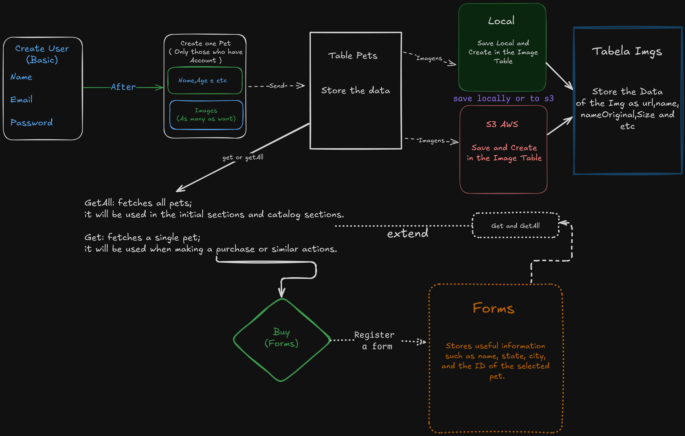

# Projeto Compass Uol **LEIA A DESCRIÇÃO ABAIXO**

Este é o repositório do **Projeto Compass Uol**. Siga os passos abaixo para configurar e rodar o projeto localmente.

## Como Baixar e Executar

### 1. Clonar o Repositório

```bash
git clone https://github.com/usuario/projeto-compass-uol.git
cd projeto-compass-uol
```

### 2. Instalar Dependências

```bash
npm install
```

### 3. Configurar Variáveis de Ambiente

Crie um arquivo `.env` com as seguintes variáveis:

```env
DB_USER = "#" # caso queira usar o de professores o user é Professores
DB_PASS = "#" # a senha é Compassuol
FRONTEND_URL = "http://localhost:3001"
PORT = 3000
AWS_ACCESS_KEY_ID=your_aws_access_key_id
AWS_SECRET_ACCESS_KEY=your_aws_secret_access_key
BUCKET_NAME=your_s3_bucket_name
STORAGE_TYPE=s3  # Ou 'local' para usar armazenamento local
```

### 4. Iniciar o Servidor

```bash
npm run start:dev
```

O projeto estará disponível em `http://localhost:3000`.

---

## Tecnologias

* **NestJS**
* **MongoDB**
* **AWS S3** (opcional)

---

---